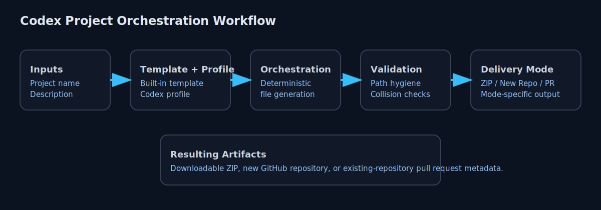
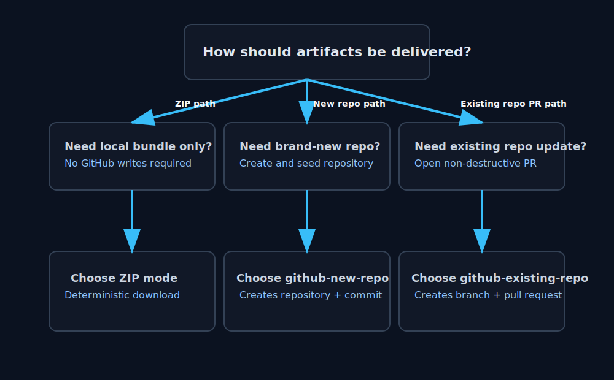

# Codex Project Orchestration Manager

Deterministic scaffold generator with GitHub-aware delivery workflows for teams that need repeatable project setup and safe repository updates.

> Start with [`STARTHERE.md`](./STARTHERE.md) for the operator runbook and execution sequence.

## What this app does

This application collects project inputs, applies a built-in template/profile, runs deterministic orchestration, validates output safety rules, and delivers artifacts through one of three modes:

1. **Download zipped bundle**
2. **Create new GitHub repo**
3. **Update existing GitHub repo via pull request**

The existing-repo path is intentionally non-destructive: it creates a branch and pull request instead of writing directly to the repository default branch.

## How it works



1. Capture deterministic inputs in the wizard.
2. Resolve template and profile.
3. Generate scaffold files in deterministic order.
4. Apply hygiene/path/collision checks.
5. Deliver artifacts using selected mode.



## Delivery modes

### 1) Download ZIP
- No GitHub login required.
- Produces deterministic scaffold files and returns a `.zip` artifact.
- Best when you want to inspect outputs locally first.

### 2) Create new GitHub repo
- Requires GitHub OAuth login.
- Creates repository (public/private), commits scaffold to default branch, and returns repository URL.
- Best when starting a brand-new project from this scaffold.

### 3) Update existing GitHub repo (safe PR flow)
- Requires GitHub OAuth login.
- Lists accessible repositories.
- Creates deterministic update branch, adds only non-colliding files, and opens PR for manual approval/merge.
- Best when extending an existing repo without direct branch writes.

## Typical workflow

1. Run ZIP mode and review generated artifacts.
2. Tune prompts/template/category until outputs are acceptable.
3. For new projects, switch to `github-new-repo`.
4. For existing repositories, switch to `github-existing-repo` and review the PR before merge.
5. Run validation checks before committing platform changes.

## Guardrails and non-destructive behavior

- Existing-repo mode never pushes directly to default branch.
- File collisions are detected deterministically and skipped.
- Structured status includes branch name, PR URL, files added, files skipped, and collisions.
- Hygiene checks exclude dangerous paths (e.g., `.env`, `*.pem`, `id_rsa`) and oversized artifacts.
- Baseline files are scaffolded: `.gitignore`, `.editorconfig`, `LICENSE` placeholder.

## GitHub authentication

Authentication uses NextAuth GitHub OAuth. Runtime values are read from `process.env` only.

Required environment variables:

- `NEXTAUTH_SECRET`
- `NEXTAUTH_URL` (production: `https://codex.killercloud.com.au`)
- `GITHUB_CLIENT_ID`
- `GITHUB_CLIENT_SECRET`
- `OUTPUT_ROOT` (optional, defaults to `./output`)

OAuth scope requirements:

- `read:user user:email repo`
- `repo` is required for repository creation and PR/branch/commit APIs.

If required runtime variables are missing, the app logs a startup/runtime error, disables GitHub auth cleanly, and exposes sanitized status via `/api/runtime-config-check`.

## API overview

- `POST /api/projects` — run orchestration for selected delivery mode.
- `POST /api/scaffold/zip` — direct deterministic zip export endpoint.
- `GET /api/auth/session` — auth/session status for UI.
- `GET /api/runtime-config-check` — sanitized runtime variable presence check.
- `GET /api/jobs/:jobId/download` — browser-friendly ZIP download endpoint.
- `GET /api/github/repos` — authenticated repository listing with pagination/search params.
- `GET /api/github/auth-check` — sanitized GitHub auth capability diagnostics.
- `GET|POST /api/auth/[...nextauth]` — NextAuth handlers.

## Local development

```bash
npm install
npm run dev
```

## Validation

```bash
npm run lint
npm run typecheck
npm run test
npm run build
```

## Notes

### iOS Chrome/Edge connectivity mitigation

If iOS Chromium browsers show `ERR_FAILED` while Safari works, serve `Alt-Svc: clear` to disable stale/broken HTTP/3 advertisements and force HTTPS over TCP fallback.

This repository sets that header globally in `next.config.ts` via `headers()`.

### Azure hostname/SSL note

Set App Service setting `NEXTAUTH_URL=https://codex.killercloud.com.au` and keep TLS termination at Azure.
